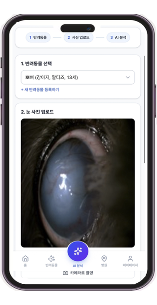
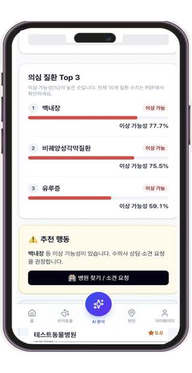
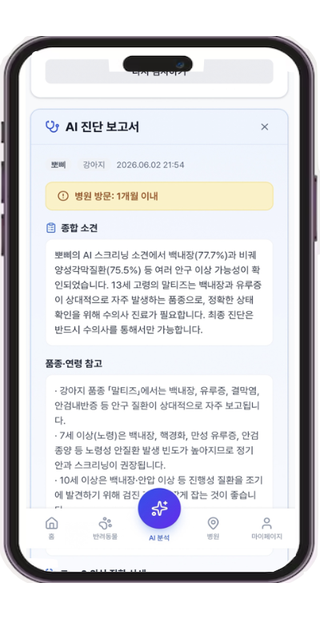
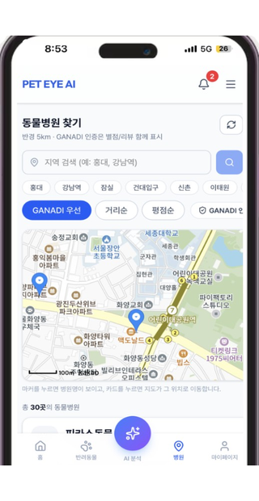
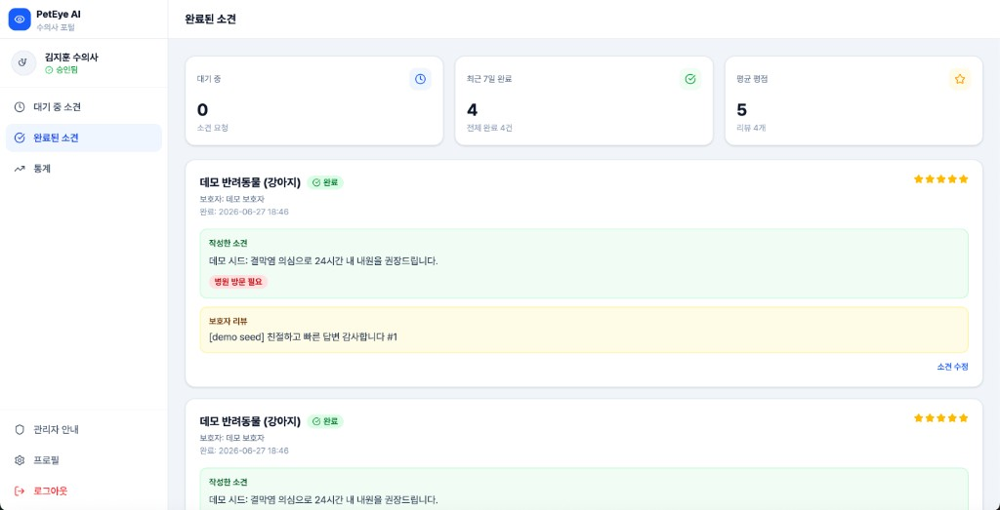
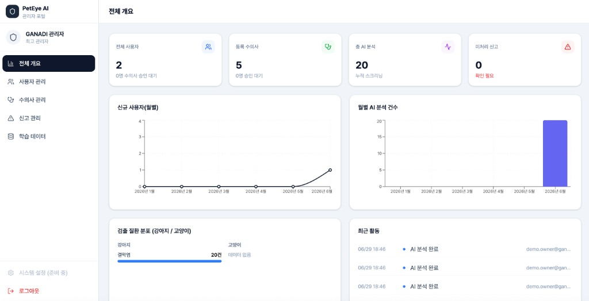
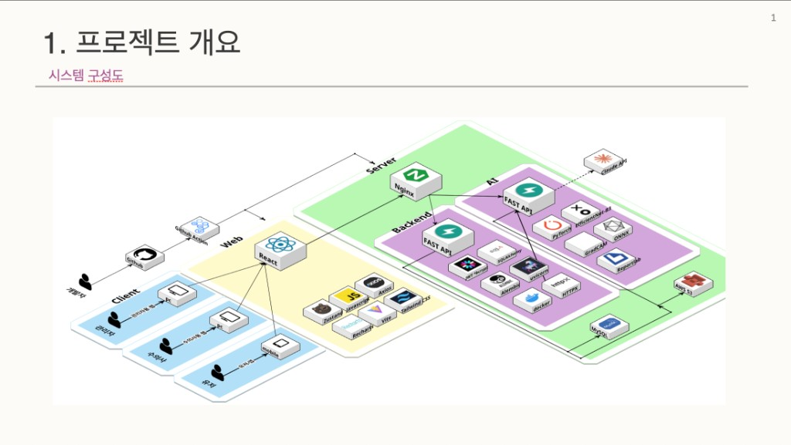

# 🐾 GANADI — 반려동물 안과질환 AI 스크리닝 플랫폼

> 반려동물의 **안구 사진 한 장**으로 10종 안과질환을 AI가 스크리닝하고,  
> 주변 동물병원·수의사 소견까지 연결하는 **모바일 웹(PWA)** 서비스

[](https://ganadi.site)
[](https://ganadi.site)
[](#-기술-스택)

**세종대학교 컴퓨터공학과 캡스톤디자인 2026-1**

---

## 📸 서비스 화면

### 보호자 (모바일 PWA)

<table align="center">
  <tr>
    <td align="center" valign="top"></td>
    <td align="center" valign="top"></td>
    <td align="center" valign="top"></td>
    <td align="center" valign="top"></td>
    <td align="center" valign="top"></td>
  </tr>
</table>

| 화면 | 설명 |
|------|------|
| **반려동물 관리** | 보호자·반려동물 프로필 등록, AI 분석 진입 |
| **사진 업로드** | 카메라 촬영 또는 갤러리 업로드 → 안구 크롭 |
| **Top-3 결과** | 10종 질환 중 의심 Top-3 + 병원 방문 CTA |
| **AI 리포트** | Claude API 기반 자연어 종합 소견 + PDF 다운로드 |
| **병원 찾기** | Kakao Map 연동, GANADI 인증 병원 우선 표시 |

### 수의사 · 관리자 포털 (PC)

<p align="center">
  
  
</p>

| 역할 | 주요 기능 |
|------|-----------|
| **수의사** | 소견 요청 수신·작성, 완료 이력·평점 관리 |
| **관리자** | 사용자/수의사 승인, 신고 처리, 월별 통계·학습 데이터 수집 |

---

## 🏗 시스템 아키텍처

<p align="center">
  
</p>

```
┌─────────────┐     ┌─────────────┐     ┌─────────────┐
│  React PWA  │────▶│  FastAPI     │────▶│  AI Server  │
│  (모바일)    │     │  REST API    │     │  ONNX 추론  │
└─────────────┘     └──────┬──────┘     └──────┬──────┘
                           │                    │
                    ┌──────┴──────┐      ┌─────┴──────┐
                    │ MySQL (RDS) │      │ Claude API │
                    │ S3 (이미지)  │      │ ReportLab  │
                    └─────────────┘      └────────────┘
```

| 계층 | 역할 |
|------|------|
| **Frontend** | React + Vite PWA, Zustand 상태관리, Kakao OAuth/Map |
| **Backend** | JWT 인증, 반려동물·진단·소견·알림 API, S3 업로드 |
| **AI Server** | EfficientNet-B3 멀티태스크 추론, GradCAM, PDF 생성 |
| **Infra** | AWS EC2, Docker Compose, Nginx, HTTPS (`ganadi.site`) |

---

## ✨ 주요 기능

### 🤖 AI 스크리닝

- 안구 사진 → **10종 질환 Top-3** 스크리닝 (강아지 10 / 고양이 5)
- **EfficientNet-B3** 멀티태스크 모델 + **10-class Softmax 감별 헤드**
- **ONNX INT8** 추론 ~38ms (PyTorch 대비 **11.6×** 가속, EC2 CPU 기준)
- **Claude API** 기반 진단 결과 자연어 해석 + **ReportLab PDF** 리포트
- 의료법 준수: "진단"이 아닌 **"AI 스크리닝 소견"** 표현 사용

### 📱 서비스 기능

- 카메라 촬영 → 안구 크롭 → 실시간 AI 분석
- Kakao Map 기반 주변 동물병원 + **GANADI 인증** 병원 필터
- **보호자 / 수의사 / 관리자** 3종 포털
- Kakao OAuth 로그인, **Web Push** 알림, 진단 이력 관리

---

## 🔬 AI 성과

> 강아지 Validation (random split, 비정상 샘플 기준). Softmax 감별 헤드 도입 전·후 비교.

| 지표 | 개선 전 | 개선 후 |
|------|---------|---------|
| **Top-1 정확도** | 27.25% | **53.77%** (≈2×) |
| **Top-3 정확도** | 51.65% | **84.35%** (+32.7%p) |
| **Device 의존성** | 9.08%p | **2.72%p** |
| **추론 시간 (CPU)** | 443ms | **38ms** (11.6×) |
| **모델 크기** | 214MB | **18MB** (INT8) |

추가 검증·벤치마크: [`models/classifier/checkpoints/README.md`](models/classifier/checkpoints/README.md)

---

## 🛠 기술 스택

| 영역 | 기술 |
|------|------|
| **Frontend** | React, TypeScript, Vite, Tailwind CSS, Zustand, PWA |
| **Backend** | FastAPI, JWT (bcrypt), SQLAlchemy, Alembic, httpx |
| **Database** | MySQL (AWS RDS), AWS S3 |
| **AI/ML** | PyTorch, EfficientNet-B3, ONNX Runtime, GradCAM |
| **External API** | Claude API, Kakao OAuth, Kakao Map |
| **Infra** | Docker Compose, AWS EC2, Nginx, GitHub Actions |

---

## 👤 담당 역할

**프론트엔드 + 백엔드 + AI 파이프라인 전체 1인 담당**

- UI/UX 설계 및 React PWA 구현 (보호자·수의사·관리자)
- FastAPI 백엔드·DB 스키마·JWT 인증·배포 파이프라인
- 데이터 전처리, 멀티태스크 학습, ONNX 변환·양자화, 추론 API
- AWS EC2 프로덕션 배포 및 `ganadi.site` 운영

---

## 🚀 실행 방법

### 빠른 시작 (모노레포 로컬)

```bash
git clone https://github.com/leejunyoung0610/capstone_petcare.git
cd capstone_petcare

# 1) AI 서버 (포트 8000 또는 8010)
python -m venv venv && source venv/bin/activate
pip install -r requirements.txt
uvicorn api.main:app --reload --host 0.0.0.0 --port 8000

# 2) 백엔드 (포트 8001) — 별도 터미널
cd backend && python -m venv venv && source venv/bin/activate
pip install -r requirements.txt
cp .env.example .env   # DATABASE_URL, AI_SERVER_URL 설정
alembic upgrade head
python -m app.main

# 3) 프론트 (포트 5173) — 별도 터미널
cd frontend && npm install && npm run dev
```

브라우저: **http://localhost:5173**

상세 가이드 (MySQL, 시드 데이터, 환경변수): [`docs/GANADI_LOCAL_RUN.md`](docs/GANADI_LOCAL_RUN.md)

### 프로덕션 (Docker Compose)

```bash
cd backend
docker compose -f docker-compose.prod.yml up -d
```

배포 상세: [`backend/docs/DEPLOYMENT.md`](backend/docs/DEPLOYMENT.md)

---

## 📁 프로젝트 구조

```
capstone_petcare/
├── frontend/          # React PWA (Vite)
├── backend/           # FastAPI · MySQL · JWT
├── api/               # AI 추론 · Claude · PDF
├── models/classifier/ # 학습·ONNX·벤치마크
├── screenshots/       # README용 서비스 캡처
└── docs/              # 로컬 실행·배포 문서
```

---

## 📚 추가 문서

| 문서 | 내용 |
|------|------|
| [PROJECT_DOCUMENTATION.md](PROJECT_DOCUMENTATION.md) | 전체 기능·API·모델 상세 |
| [docs/GANADI_LOCAL_RUN.md](docs/GANADI_LOCAL_RUN.md) | 로컬 3-tier 실행 |
| [models/classifier/checkpoints/README.md](models/classifier/checkpoints/README.md) | 모델 파일·ONNX 벤치마크 |

---

## ⚠️ 면책

본 서비스는 **의료 진단을 대체하지 않습니다.** AI 결과는 참고용 스크리닝 소견이며, 정확한 진단·치료는 반드시 수의사와 상담하세요.

---

## 📄 라이선스

세종대학교 컴퓨터공학과 캡스톤디자인 프로젝트 (2026)
